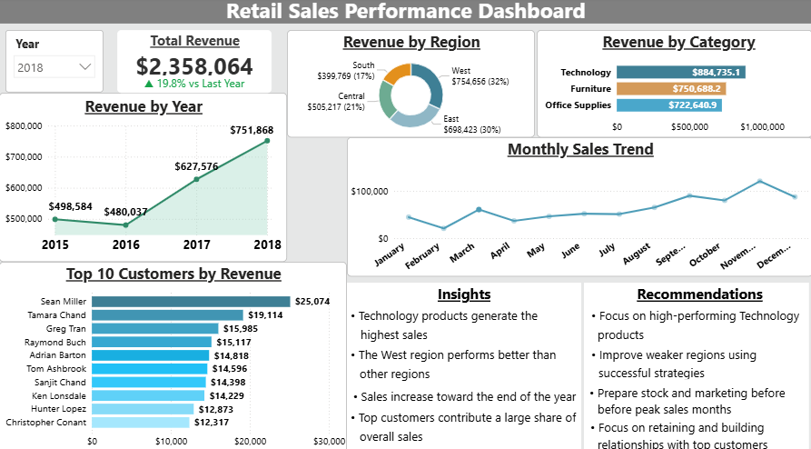

# Retail Sales Data Analysis

## Project Overview

This project analyzes retail sales data to understand revenue trends, customer behavior, and regional performance.

The goal is to identify patterns and provide simple, practical insights to support better business decisions.

---

## Dashboard Preview

---

## Key Objectives

* Analyze overall revenue performance
* Understand sales trends over time
* Identify top-performing products and regions
* Evaluate customer contribution to total sales

---

## Tools Used

* Python (Pandas) – Data cleaning and preparation
* SQL – Data analysis and business queries
* Power BI / Tableau – Data visualization and dashboard

---

## Project Files

* `clean_superstore.csv` → Original dataset
* `dim_date.csv` → Date dimension table
* `dim_customer.csv` → Customer dimension table
* `dim_product.csv` → Product dimension table
* `dim_region.csv` → Region dimension table
* `fact_sales.csv` → Fact table with sales data
* `data_preparation.py` → Data cleaning and transformation
* `sales_analysis.sql` → SQL queries for analysis
* `dashboard.png` → Dashboard preview

---

## Data Preparation

* Cleaned and standardized column names
* Handled inconsistent date formats
* Removed duplicate columns and records
* Created dimension tables (date, customer, product, region)
* Generated surrogate keys for efficient joins
* Built fact table for sales analysis

---

## Key Insights

* Technology products generate the highest sales
* The West region performs better than other regions
* Sales increase toward the end of the year
* Top customers contribute a large share of overall sales

---

## Recommendations

* Focus on high-performing Technology products
* Improve weaker regions using successful strategies
* Prepare stock and marketing before peak sales months
* Focus on retaining and building relationships with top customers
